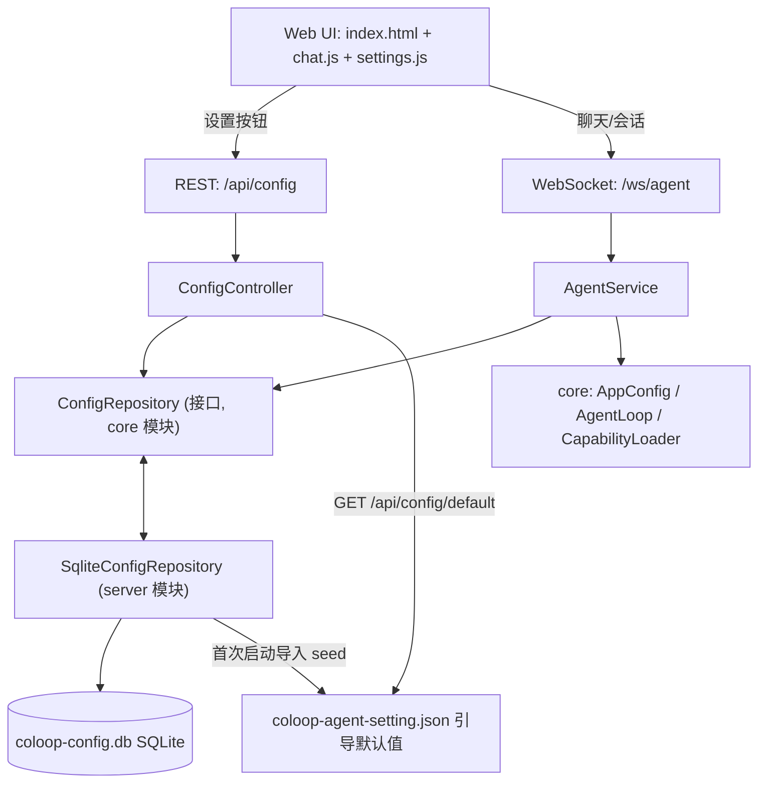
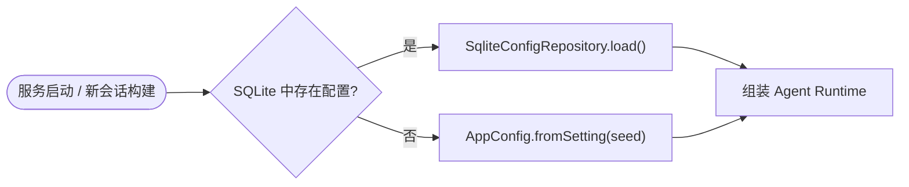
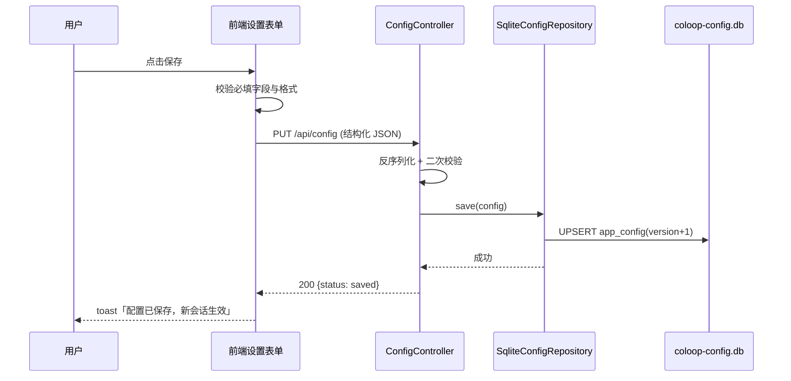

# 模型配置持久化到 SQLite 并支持 Web 设置界面

Feature Name: model-config-sqlite
Updated: 2026-08-24

## Description

本特性将 coloop-agent 的模型、MCP、语音等配置从 `coloop-agent-setting.json` 配置文件迁移到本地 SQLite 数据库，并新增 Web 设置界面（左下角设置按钮 → 弹出表单）供用户在线编辑配置。配置文件内容作为首次启动的引导默认值（seed）与参考备注保留。

同时建立 Git 提交作者校验机制，将本地与远程提交作者统一为 `greatColin <34583190+greatColin@users.noreply.github.com>`，并在提交/推送前校验。

设计约束：
- core 模块保持"教学核心、永远精简"，只新增配置仓库抽象接口，不引入任何数据库依赖。
- server 模块使用 `sqlite-jdbc` 轻量方案（无 ORM），数据库文件为运行目录下的 `./coloop-config.db`。
- API Key 在设置表单中明文展示、可编辑，本地单机工具，保存时原样入库。

## Architecture

### 分层架构



### 配置加载优先级



### 配置保存流程



## Components and Interfaces

### 1. core 模块：配置仓库抽象

新增 `com.coloop.agent.runtime.config.ConfigRepository`：

```java
package com.coloop.agent.runtime.config;

import java.util.Optional;

/** 配置持久化抽象。实现方由 server 模块提供（SQLite）。 */
public interface ConfigRepository {
    /** 加载已持久化的配置；无数据时返回 empty。 */
    Optional<AppConfig> load();

    /** 保存配置；已存在则覆盖并递增版本号。 */
    void save(AppConfig config);

    /** 是否存在已持久化的配置数据。 */
    boolean hasStoredConfig();
}
```

`AppConfig` 类本身保持不变，继续作为配置内存模型与 JSON 序列化载体（Jackson 序列化后存入 SQLite）。

### 2. server 模块：SQLite 实现

新增 `com.coloop.agent.server.config.SqliteConfigRepository implements ConfigRepository`：

- 构造参数：数据库文件路径（默认 `./coloop-config.db`），Spring 通过 `@Value("${coloop.config.db-path:./coloop-config.db}")` 注入。
- 初始化建表（`initSchema`）：

```sql
CREATE TABLE IF NOT EXISTS app_config (
    id          INTEGER PRIMARY KEY AUTOINCREMENT,
    config_key  TEXT    UNIQUE NOT NULL,
    config_json TEXT    NOT NULL,
    version     INTEGER NOT NULL DEFAULT 1,
    updated_at  INTEGER NOT NULL
);
```

- `seedFromSetting()`：首次启动且表为空时，读取 `coloop-agent-setting.json` 解析为 `AppConfig`，序列化写入 `app_config`（config_key = `main`）。
- `load()`：读取 `app_config` 中最新一行，反序列化为 `AppConfig`。
- `save(config)`：事务内 UPSERT，`version = version + 1`。
- 使用 sqlite-jdbc 提供的 JDBC API，单连接 + 写锁（本地单用户，无并发写需求）。

新增依赖（server/pom.xml）：

```xml
<dependency>
    <groupId>org.xerial</groupId>
    <artifactId>sqlite-jdbc</artifactId>
    <version>3.45.3.0</version>
</dependency>
```

### 3. server 模块：REST 控制器

新增 `com.coloop.agent.server.controller.ConfigController`：

| 方法 | 路径 | 说明 |
|------|------|------|
| GET | `/api/config` | 返回当前配置（`AppConfig` JSON 视图，apiKey 明文）。无持久化数据时返回 seed 配置并标记 `fromSeed: true` |
| PUT | `/api/config` | 保存配置。请求体为 `AppConfig` 结构；校验通过后写入 SQLite，返回 `{status:"saved", version:N}` |
| GET | `/api/config/default` | 返回 `coloop-agent-setting.json` 原始内容（含注释的 jsonc 文本），作为表单参考备注展示 |

PUT 校验规则：
- `defaultModel` 若非空，必须存在于 `models` 的 key 中。
- 每个 `model` 条目必须包含 `apiBase` 与 `model` 字段，`apiKey` 允许为空。
- `mcpServers` 每项必须包含 `command`；`args` 必须为数组。
- `maxIterations`、`execTimeoutSeconds` 必须为正整数。

### 4. AgentService 集成

`AgentService` 改为 Spring 构造注入 `ConfigRepository`，新会话构建时：

```java
AppConfig config = configRepository.load()
        .orElseGet(() -> AppConfig.fromSetting("coloop-agent-setting.json"));
```

替换现有 `AppConfig.fromSetting("coloop-agent-setting.json")` 硬编码调用。配置保存后无需重启即可在下一个会话生效（每次构建读取最新配置）。

启动时初始化：新增 `ConfigInitializer`（实现 `ApplicationRunner`），调用 `SqliteConfigRepository.initSchema()` 与 `seedFromSetting()`。

### 5. 前端：设置入口与表单

- `index.html`：在 `<aside class="agent-sidebar">` 底部（`sidebar-sections` 之后）新增设置按钮：

```html
<div class="sidebar-footer">
    <button id="settings-btn" class="settings-btn" title="设置">⚙ 设置</button>
</div>
```

- 新增 `settings.js`（在 `chat.js` 之后引入），职责：
  1. 页面加载后 `GET /api/config` 拉取当前配置并填充表单。
  2. 点击「设置」按钮弹出模态框（遮罩层 + 面板），含三个区块：全局配置、模型列表、MCP 列表，以及可折叠的「参考备注（seed 配置）」。
  3. 模型条目动态增删：每行字段 key、description、model、apiKey、apiBase、maxContextSize、maxTokens、temperature。
  4. MCP 条目动态增删：每行字段 key、description、command、args（逗号分隔自动转数组）、env（每行 `KEY=value` 文本域转 Map）。
  5. 点击保存：前端必填校验 → `PUT /api/config` → 成功 toast「配置已保存，新配置将在新会话生效」。
  6. `defaultModel` 下拉选项随模型列表同步刷新；默认选中当前 `defaultModel`。

- `chat.js` 无需改动；设置弹窗与聊天 UI 相互独立。

### 6. Git 提交作者校验

目标作者：`greatColin <34583190+greatColin@users.noreply.github.com>`。

#### 6.1 一次性初始化

```bash
# 设置本地作者
git config user.name "greatColin"
git config user.email "34583190+greatColin@users.noreply.github.com"

# 启用项目级 git hooks
git config core.hooksPath .githooks
```

#### 6.2 持续校验（git hooks）

新增 `.githooks/pre-commit` 与 `.githooks/pre-push`（可执行，内容一致）：

```sh
#!/bin/sh
TARGET_NAME="greatColin"
TARGET_EMAIL="34583190+greatColin@users.noreply.github.com"
if [ "$(git config user.name)" != "$TARGET_NAME" ]; then
    echo "[coloop-git-check] user.name 应为 $TARGET_NAME，当前: $(git config user.name)" >&2
    exit 1
fi
if [ "$(git config user.email)" != "$TARGET_EMAIL" ]; then
    echo "[coloop-git-check] user.email 应为 $TARGET_EMAIL，当前: $(git config user.email)" >&2
    exit 1
fi
exit 0
```

提交/推送前 Git 自动执行校验，不一致即中断。

#### 6.3 历史提交重写并覆盖远程（一次性、用户确认后执行）

1. 全量拉取历史：`git fetch --all`
2. 备份镜像：`git clone --mirror origin /tmp/opencode/coloop-backup.git`
3. 重写 author 与 committer（将历史中的 `程麟 <cl281@fjdaze.com>`、`monkeycode-ai <monkeycode-ai@chaitin.com>` 等统一替换为目标作者）：
   - 优先使用 `git filter-repo --mailmap`（若环境可用）；
   - 否则使用 `git filter-branch --env-filter ... -- --all` 等价逻辑。
4. 清理 `refs/original/` 引用。
5. 用户确认后强制覆盖远程：`git push --force --all origin && git push --force --tags origin`。

风险提示：force push 会重写远程历史，仅限单人仓库且在备份完成后、经用户明确确认执行。

## Data Models

### SQLite 表：app_config

| 列 | 类型 | 说明 |
|----|------|------|
| id | INTEGER PRIMARY KEY AUTOINCREMENT | 主键 |
| config_key | TEXT UNIQUE NOT NULL | 配置键，当前固定 `main` |
| config_json | TEXT NOT NULL | 序列化后的 `AppConfig` JSON（含 models/mcpServers/defaultModel/maxIterations/execTimeoutSeconds/voice） |
| version | INTEGER NOT NULL | 版本号，每次保存 +1 |
| updated_at | INTEGER NOT NULL | 更新时间（epoch millis） |

### 配置 JSON 结构（与现有 jsonc 兼容）

```json
{
  "defaultModel": "minimax",
  "maxIterations": 50,
  "execTimeoutSeconds": 30,
  "models": {
    "minimax": {
      "description": "主模型，能力强，适合复杂任务",
      "apiKey": "sk-...",
      "apiBase": "https://api.minimaxi.com/v1",
      "model": "MiniMax-M2.7",
      "maxContextSize": "200k",
      "maxTokens": 2048,
      "temperature": 0.7
    }
  },
  "mcpServers": {
    "MiniMax": {
      "command": "uvx",
      "args": ["minimax-coding-plan-mcp"],
      "env": { "MINIMAX_API_KEY": "..." }
    }
  },
  "voice": { "language": "zh" }
}
```

说明：seed 文件中的 `${VAR}` 占位符与注释仅存在于原始 jsonc 文本；持久化时保存展开后的明文值，注释不保存。

## Correctness Properties

1. **seed 只导入一次**：`seedFromSetting` 仅在 `app_config` 表为空时执行；用户保存的配置永不被 seed 覆盖。
2. **配置加载优先级**：SQLite 有数据时优先使用数据库配置；无数据时回退 JSON seed。
3. **保存原子性**：单条 UPSERT 在事务内完成，失败不影响旧数据。
4. **版本单调递增**：每次保存 `version+1`，用于排查配置来源。
5. **配置校验完整**：服务端 PUT 校验 + 前端必填校验双重保障，非法配置不入库。
6. **Git 校验阻断**：pre-commit / pre-push hook 在作者信息不一致时以非零退出码阻断操作。

## Error Handling

| 场景 | 处理 |
|------|------|
| SQLite 文件不可写/无法打开 | 启动时记录 ERROR 日志并回退 JSON seed 继续运行；`/api/config` 返回 500 与错误信息 |
| seed 文件缺失或解析失败 | 启动时告警，配置库初始化为空，`GET /api/config` 返回空配置 + `fromSeed:false` |
| PUT 请求体 JSON 解析失败 | 返回 400 `{"error":"配置 JSON 格式错误"}` |
| PUT 字段校验失败 | 返回 400，携带具体字段错误（如 `models.minimax.model 不能为空`） |
| `defaultModel` 指向不存在的模型 key | 返回 400，提示修正 |
| 配置保存后 AgentService 读取 | 无异常路径；每次构建重新读取，会话运行中不受影响（下个会话生效） |

## Test Strategy

### 单元测试（server 模块，JUnit 5）

1. `SqliteConfigRepositoryTest`
   - 空库首次启动导入 seed 配置。
   - `load()` 返回持久化配置；`hasStoredConfig()` 正确。
   - `save()` 覆盖旧配置并递增版本号。
   - 无数据时 `load()` 返回 empty，回退 JSON 生效。
   - 损坏 JSON 时返回 empty 且不崩溃。
2. `ConfigControllerTest`
   - `GET /api/config` 返回当前配置；无持久化数据时返回 seed 并标记 `fromSeed`。
   - `GET /api/config/default` 返回 jsonc 原文。
   - `PUT /api/config` 合法请求保存成功；非法请求返回 400 与字段错误。
   - `defaultModel` 指向不存在模型时返回 400。

### 前端验证

- 手动验证：设置按钮出现于侧边栏底部；弹窗表单增删模型/MCP；保存后新会话使用新配置。
- 配置切换验证：修改 `defaultModel` 后新建会话，确认 LLM 请求打到新端点。

### Git Hook 验证

- 设置错误作者后执行 `git commit --dry-run` 或触发 pre-commit，确认被阻断并输出提示。
- 恢复正确作者后正常提交/推送。
- 历史重写后 `git log --format='%an <%ae>'` 全部为 `greatColin <34583190+greatColin@users.noreply.github.com>`。

## References

[^1]: (coloop-agent-core/src/main/resources/coloop-agent-setting.json#L1) - 现有配置 seed 文件
[^2]: (coloop-agent-core/src/main/java/com/coloop/agent/runtime/config/AppConfig.java#L201) - `AppConfig.fromSetting` JSON 配置加载
[^3]: (coloop-agent-server/src/main/java/com/coloop/agent/server/service/AgentService.java#L104) - `AgentService` 中配置文件加载点
[^4]: (coloop-agent-server/src/main/resources/static/index.html#L784) - 侧边栏结构，设置按钮插入位置
[^5]: (coloop-agent-server/src/main/resources/static/chat.js#L198) - WebSocket 消息分发（设置模块独立，不改动）
[^6]: (coloop-agent-server/pom.xml#L18) - server 模块依赖，需新增 sqlite-jdbc
