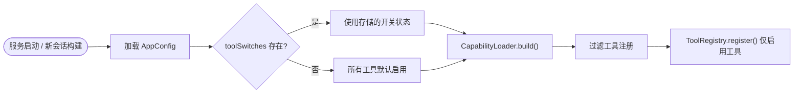

# Web端可配置工具开关

Feature Name: tool-switch
Updated: 2026-08-24

## Description

在 Web 设置界面新增「工具」Tab，允许用户单独开启/关闭每个内置工具（Exec、ReadFile、WriteFile、EditFile、SearchFiles、ListDirectory、MCP Client、Task Management 等）。开关状态持久化到 SQLite 数据库，默认全部开启。LLM 仅能调用已启用的工具。

## Architecture

### 整体架构

```mermaid
graph TD
    UI["Web UI: settings.js 工具 Tab"]
    REST["REST: /api/config PUT"]
    CTRL["ConfigController"]
    REPO["ConfigRepository"]
    SQLITE["SqliteConfigRepository"]
    DB[("coloop-config.db  SQLite")]
    APP["AppConfig (含 toolSwitches)"]
    LOADER["CapabilityLoader"]
    REGISTRY["ToolRegistry"]
    CORE["core: StandardCapability / Tool"]

    UI -->|工具开关配置| REST
    REST --> CTRL
    CTRL --> REPO
    REPO <--> SQLITE
    SQLITE --> DB
    APP -->|build()| LOADER
    LOADER -->|过滤后注册| REGISTRY
    REGISTRY -->|getDefinitions()| CORE
```

### 工具开关加载流程



## Components and Interfaces

### 1. core 模块：AppConfig 新增 toolSwitches 字段

```java
// AppConfig.java 新增字段
private Map<String, Boolean> toolSwitches = new HashMap<>();

public Map<String, Boolean> getToolSwitches() { return toolSwitches; }
public void setToolSwitches(Map<String, Boolean> toolSwitches) { this.toolSwitches = toolSwitches; }

public boolean isToolEnabled(String toolId) {
    return toolSwitches.getOrDefault(toolId, true);
}
```

`toolSwitches` 为 `Map<工具ID, 是否启用>`，工具 ID 为 `StandardCapability` 的 `id` 字段值（如 `exec`、`read_file`、`mcp_client`）。

**注意**：MCP 服务器返回的动态工具暂不支持单独开关，仅支持通过 `mcp_client` 开关整体控制 MCP 客户端的启用/禁用。

### 2. core 模块：CapabilityLoader 过滤未启用工具

在 `CapabilityLoader.build()` 中，根据 `StandardCapability` ID 过滤工具：

```java
public @NotNull AgentLoop build(LLMProvider provider, AppConfig config) {
    ToolRegistry registry = new ToolRegistry();

    for (Tool t : tools) {
        String toolId = StandardCapability.getToolIdFromInstance(t);
        if (toolId == null || config.isToolEnabled(toolId)) {
            registry.register(t);
        }
    }
    // ...
}
```

新增 `StandardCapability.getToolIdFromInstance()` 方法，通过类名字面量匹配工具实例与 Capability：

```java
public static String getToolIdFromInstance(Object instance) {
    String instanceClassName = instance.getClass().getSimpleName();
    for (StandardCapability cap : values()) {
        if (cap.getType() == CapabilityType.TOOL || cap.getType() == CapabilityType.COMPOSITE) {
            // 通过 factory 创建临时实例对比类名
            Object demo = cap.create(null);
            if (demo.getClass().getSimpleName().equals(instanceClassName)) {
                return cap.getId();
            }
        }
    }
    return null;
}
```

**MCP 特殊处理**：`McpCapability` 返回的是动态工具列表，工具 ID 无法预先映射。设计上 `mcp_client` 开关仅控制 `McpCapability` 本身是否加载，而 MCP 服务器返回的工具始终可用（暂不支持单独开关）。

### 3. server 模块：SQLite 存储工具开关

工具开关与 `AppConfig` 一起序列化存储。`AppConfig` 整体序列化为 JSON 存入 SQLite，`toolSwitches` 字段自动包含在内。

**首次启动默认值**：当 `AppConfig` 中 `toolSwitches` 为空或 null 时，视为首次启动，将所有 `StandardCapability` 中类型为 `TOOL` 和 `COMPOSITE` 的 ID 初始化为 `true`（启用）。

此初始化逻辑放在 `AgentService` 或 `ConfigInitializer` 中：

```java
// ConfigInitializer.java 或 AgentService 中
private void initializeDefaultToolSwitches(AppConfig config) {
    if (config.getToolSwitches() == null || config.getToolSwitches().isEmpty()) {
        Map<String, Boolean> switches = new HashMap<>();
        for (StandardCapability cap : StandardCapability.values()) {
            if (cap.getType() == CapabilityType.TOOL || cap.getType() == CapabilityType.COMPOSITE) {
                switches.put(cap.getId(), true);
            }
        }
        config.setToolSwitches(switches);
    }
}
```

### 4. server 模块：REST API

`ConfigController` 的 `PUT /api/config` 无需修改，请求体中包含 `toolSwitches` 字段即可。

新增 `GET /api/config/tools` 可选 API，返回所有工具的定义列表（用于前端渲染工具名称和描述）：

| 方法 | 路径 | 说明 |
|------|------|------|
| GET | `/api/config` | 返回完整配置（含 toolSwitches） |
| PUT | `/api/config` | 保存配置（含 toolSwitches） |
| GET | `/api/config/tools` | 返回所有工具的 ID、名称、描述列表 |

### 5. 前端：设置界面工具 Tab

在 `settings.js` 中新增「工具」Tab：

```javascript
// settings.js 新增
'<button class="settings-tab" data-tab="tools">工具</button>'
```

Tab 内容：

```html
<div class="settings-tab-content" id="tab-tools" style="display:none">
    <div id="tools-list"></div>
</div>
```

工具列表通过 `GET /api/config` 返回的 `toolSwitches` 渲染开关。每项显示：
- 工具名称（从 `StandardCapability` 枚举或 `GET /api/config/tools` 获取）
- 工具描述
- Toggle Switch（启用/禁用）

## Data Models

### AppConfig JSON 结构（新增 toolSwitches）

```json
{
  "defaultModel": "minimax",
  "maxIterations": 50,
  "execTimeoutSeconds": 30,
  "models": { ... },
  "mcpServers": { ... },
  "voice": { ... },
  "toolSwitches": {
    "exec": true,
    "read_file": true,
    "write_file": true,
    "edit_file": true,
    "search_files": true,
    "list_directory": true,
    "mcp_client": true,
    "task_management": true,
    "skill_prompt": true
  }
}
```

## Correctness Properties

1. **默认启用**：首次启动时所有工具默认为启用状态，用户无需配置即可使用全部功能。
2. **开关生效时机**：工具开关变更后，下一个会话（新 AgentRuntime）生效，运行中的会话不受影响。
3. **关闭工具不可调用**：已禁用的工具在 `ToolRegistry.getDefinitions()` 中不返回，LLM 无法看到和调用。
4. **序列化兼容**：旧版本配置（无 toolSwitches 字段）加载时自动初始化所有工具为启用。

## Error Handling

| 场景 | 处理 |
|------|------|
| toolSwitches 中出现未知工具 ID | 忽略未知 ID，仅处理已知的 StandardCapability ID |
| toolSwitches JSON 解析失败 | 回退到所有工具启用 |
| 禁用 exec 导致命令执行失败 | 正常返回 `[Error: tool not found: exec]`，不影响系统稳定性 |

## Test Strategy

### 单元测试

1. `AppConfigTest`
   - `isToolEnabled()` 默认返回 true
   - `isToolEnabled()` 正确读取 toolSwitches 中的值
   - 空 toolSwitches 时默认启用

2. `CapabilityLoaderTest`
   - 仅启用工具被注册到 ToolRegistry
   - 禁用工具未被注册
   - `getDefinitions()` 仅返回已启用工具

3. `SqliteConfigRepositoryTest`（扩展）
   - 配置保存后 toolSwitches 正确持久化和加载
   - 首次启动时 toolSwitches 为空，自动初始化为全启用

### 前端验证

- 打开设置面板，切换到「工具」Tab，确认所有工具列表显示
- 关闭某个工具，保存后新建会话，确认该工具不在 LLM 函数列表中
- 重新开启工具，确认恢复可用

## References

[^1]: (coloop-agent-core/src/main/java/com/coloop/agent/runtime/StandardCapability.java#L1) - StandardCapability 枚举，工具 ID 来源
[^2]: (coloop-agent-core/src/main/java/com/coloop/agent/runtime/CapabilityLoader.java#L129) - `build()` 方法，工具注册入口
[^3]: (coloop-agent-core/src/main/java/com/coloop/agent/core/tool/ToolRegistry.java#L15) - ToolRegistry 工具注册表
[^4]: (coloop-agent-server/src/main/resources/static/settings.js#L1) - 设置界面前端实现
[^5]: (.monkeycode/specs/2026-08-24-model-config-sqlite/design.md#L1) - 模型配置 SQLite 设计参考
